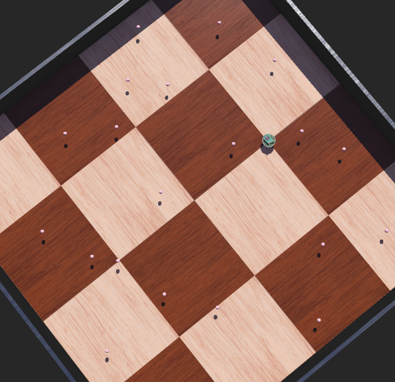

# CSCI5552 Homework 3 (Spring 2022)
## Description
In this homework, you will implement an extended Kalman Filter (EKF).
Your robot will receive different kinds of measurements from 25 known landmarks.
You will be asked to submit a screenshot of your results and your controller source code for this homework assignment.

## Submission
* Your controller code: hw3_controller.py
* A screenshot (two screenshots if you did the bonus part) of your simulation.